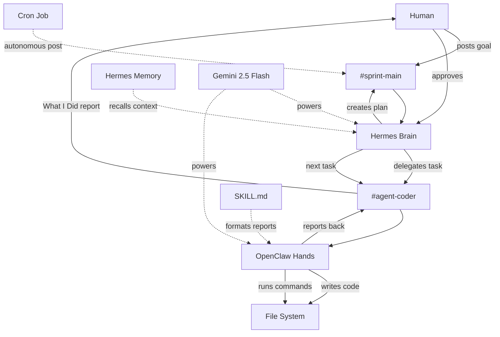

# Architecture

## Agent Roles Table
| Agent | Role | Channel | Model | Trigger |
| --- | --- | --- | --- | --- |
| Hermes | Orchestrator and planner | #sprint-main | google/gemini-2.5-flash | Human goal or cron prompt |
| OpenClaw | Coding and command execution | #agent-coder | google/gemini-2.5-flash | Hermes delegation |

## Slack Channel Scheme Table
| Channel | Purpose | Who posts | Who reads |
| --- | --- | --- | --- |
| #sprint-main | Planning and human approvals | Human, Hermes | Human, Hermes |
| #agent-coder | Coding task execution and reports | Hermes, OpenClaw | Human, Hermes, OpenClaw |
| #agent-log | Autonomous run history | Cron, Hermes | Human, Hermes |

## Model Routing Decision
Gemini 2.5 Flash powers both agents because its free-tier 1M TPM limit can handle large codebase context windows. Groq was initially tested, but the build hit the 12,000 TPM free-tier ceiling when OpenClaw reached a 53,000 token context. Switching both agents to Gemini avoided context truncation and kept the loop simple.

## Human-in-the-Loop Flow
1. Human posts goal in #sprint-main.
2. Hermes reads the goal and creates a plan.
3. Hermes delegates implementation work to OpenClaw in #agent-coder.
4. OpenClaw builds the requested code and runs verification commands.
5. OpenClaw reports back with a status report.
6. Human reviews the result.
7. Human approves the next task or asks for changes.

## Mermaid Diagram


## Autonomous Operation
Hermes has an autonomous cron job that fires every 10 minutes and posts a status or planning update to #sprint-main without a direct human prompt.

## File Structure
```text
forge2-qualifier-sahil/
├── README.md
├── ARCHITECTURE.md
├── agent-log.md
├── .env.example
├── .gitignore
├── backend/
│   ├── app/
│   │   ├── Http/Controllers/
│   │   └── Models/
│   ├── bootstrap/app.php
│   ├── config/cors.php
│   ├── database/
│   │   ├── database.sqlite
│   │   └── migrations/
│   ├── routes/api.php
│   ├── render.yaml
│   └── .env.example
├── frontend/
│   ├── dist/
│   ├── netlify.toml
│   ├── src/
│   │   ├── api.js
│   │   ├── App.jsx
│   │   ├── BoardView.jsx
│   │   ├── ListColumn.jsx
│   │   ├── CardItem.jsx
│   │   ├── CardModal.jsx
│   │   └── App.css
│   └── .env.example
├── skills/status-report/SKILL.md
└── slack-export/README.txt
```
