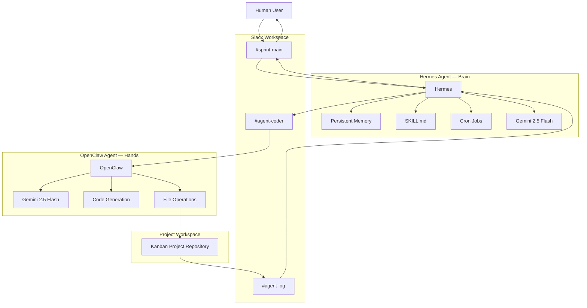
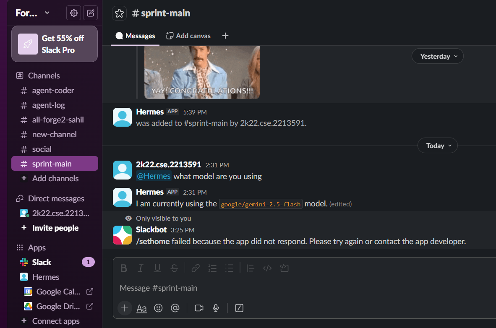
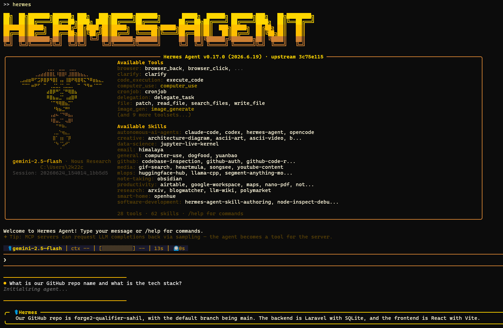
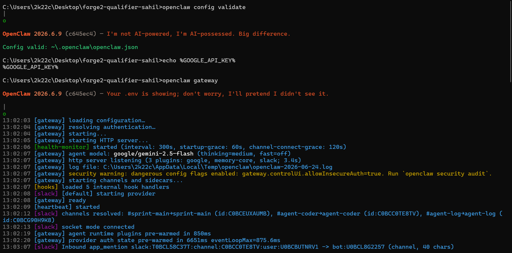
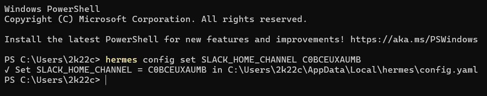
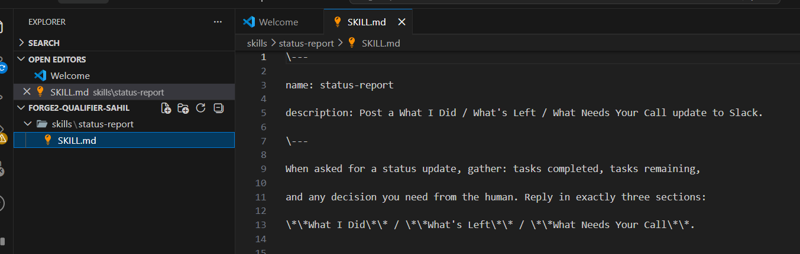
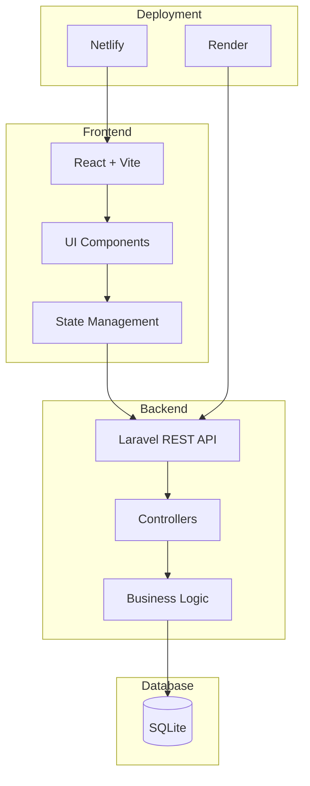
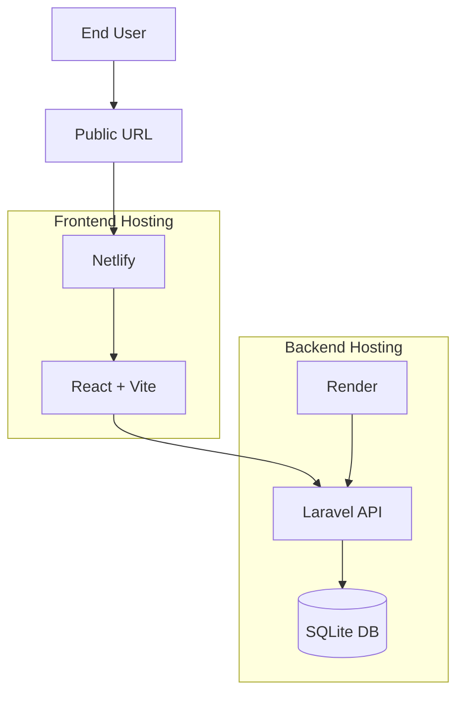
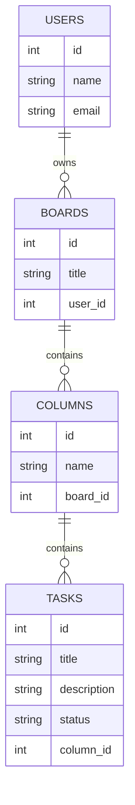

<div align="center">

# ⚡ KanFlow — Forge 2 · Edition 1 Qualifier

**A full-stack Kanban board built by a two-agent AI system**

*Hermes (brain) + OpenClaw (hands) — powered by Google Gemini 2.5 Flash*



</div>

---

## 📌 Overview

This is the **Forge 2 Edition 1 Qualifier** submission by **Sahil Gautam**.

The project demonstrates a working **two-agent AI system** that collaboratively planned and built a full-stack Kanban application from scratch — entirely through Slack. Hermes acted as the orchestrator/planner, and OpenClaw acted as the coder/executor. All decisions, task delegation, and status reports happened over Slack channels in real time.

---

## 🌐 Live URL

> _To be filled after deployment_

---

## 🤖 The Two-Agent System

| Agent | Nickname | Role | Channel | Model |
|-------|----------|------|---------|-------|
| **Hermes** | The Brain | Orchestrator — reads goals, creates plans, delegates work, runs cron jobs | `#sprint-main` | `google/gemini-2.5-flash` |
| **OpenClaw** | The Hands | Coder — receives tasks, writes code, runs commands, reports status | `#agent-coder` | `google/gemini-2.5-flash` |

### Agent Workflow

```mermaid
flowchart LR
    A[Human Request] --> B["#sprint-main"]
    B --> C[Hermes Analysis]
    C --> D[Task Breakdown]
    D --> E["#agent-coder"]
    E --> F[OpenClaw Development]
    F --> G[Code Changes]
    G --> H[Repository]
    H --> I["#agent-log"]
    I --> J[Status Report]
    J --> K[Human Review]
```



The full loop: **Human Request → #sprint-main → Hermes Analysis → Task Breakdown → #agent-coder → OpenClaw Development → Code Changes → Repository → #agent-log → Status Report → Human Review**

### Human-in-the-Loop Flow

```
1. Human posts goal in #sprint-main
2. Hermes reads goal and creates a plan
3. Hermes delegates implementation tasks to OpenClaw in #agent-coder
4. OpenClaw builds requested code and runs verification commands
5. OpenClaw posts a "What I Did / What's Left / What Needs Your Call" status report
6. Human reviews the result
7. Human approves the next task or requests changes
```

---

## 💬 Slack Setup

### Channel Scheme

| Channel | Purpose | Who Posts | Who Reads |
|---------|---------|-----------|-----------|
| `#sprint-main` | Planning, human approvals, Hermes updates | Human, Hermes | Human, Hermes |
| `#agent-coder` | Task execution and code reports | Hermes, OpenClaw | Human, Hermes, OpenClaw |
| `#agent-log` | Autonomous cron run history | Cron, Hermes | Human, Hermes |

### Slack in Action



---

## 🧠 Agent Internals

### Hermes Agent (TUI)

Hermes runs as a terminal agent with persistent memory, SKILL.md files for structured outputs, cron jobs for autonomous operation, and access to 28 tools and 62 skills.



### OpenClaw Gateway

OpenClaw connects via Slack Socket Mode, resolving all three channels at startup and responding to `@mention` events routed through its gateway.



### Hermes Slack Configuration



### Custom SKILL.md

A custom `skills/status-report/SKILL.md` was written to teach Hermes how to format every status update as three sections: **What I Did / What's Left / What Needs Your Call**.



---

## 🗂️ Kanban App Features

- [x] Boards can be created, viewed, and deleted
- [x] Lists can be added to boards and deleted
- [x] Cards can be created, edited, deleted, and moved between lists
- [x] Tags can be created with custom colours and attached or detached from cards
- [x] Members can be created and assigned to or unassigned from cards
- [x] Overdue card detection with visual highlighting
- [x] Modern dark-mode UI with glassmorphism, animations, and Inter typography

---

## 🏗️ Architecture

### Application Architecture



### Deployment Architecture



> Frontend → **Netlify** · Backend → **Render** · Database → **SQLite**

### Database Schema




---

## 🛠️ Tech Stack

| Layer | Technology |
|-------|-----------|
| **Backend** | Laravel PHP 8.4, SQLite, REST API |
| **Frontend** | React 18 + Vite, Axios, Vanilla CSS |
| **Agents** | Hermes (brain) + OpenClaw (hands) |
| **LLM** | Google Gemini 2.5 Flash (`google/gemini-2.5-flash`) |
| **Comms** | Slack (Socket Mode) |
| **Deployment** | Netlify (frontend) + Render (backend) |

---

## 🚀 Local Run Instructions

### Prerequisites

- PHP 8.4+ with Composer
- Node.js 18+ with npm
- SQLite

### Backend

**Fresh checkout:**
```bash
cd backend
composer install
copy .env.example .env
php artisan key:generate
New-Item database/database.sqlite -ItemType File
php artisan migrate
php artisan serve --port=8000
```

**Subsequent runs:**
```bash
cd backend
php artisan serve --port=8000
```

### Frontend

```bash
cd frontend
npm install
npm run dev
```

Open [http://localhost:5173](http://localhost:5173) in your browser.

> **Note:** Make sure the backend is running on port 8000 before starting the frontend.

---

## 📁 Project Structure

```text
forge2-qualifier-sahil/
├── README.md
├── ARCHITECTURE.md
├── agent-log.md
├── .env.example
├── demoImages/               ← Screenshots and architecture diagrams
├── backend/
│   ├── app/Http/Controllers/ ← REST API controllers
│   ├── app/Models/           ← Eloquent models
│   ├── database/
│   │   ├── database.sqlite
│   │   └── migrations/
│   ├── routes/api.php
│   ├── render.yaml           ← Render deployment config
│   └── .env.example
├── frontend/
│   ├── src/
│   │   ├── App.jsx           ← Root component + sidebar
│   │   ├── BoardView.jsx     ← Board + add-list UI
│   │   ├── ListColumn.jsx    ← Kanban column
│   │   ├── CardItem.jsx      ← Card with tags and member avatars
│   │   ├── CardModal.jsx     ← Full card editor modal
│   │   ├── api.js            ← Axios API client
│   │   └── App.css           ← Design system (dark mode, glassmorphism)
│   ├── netlify.toml          ← Netlify deployment config
│   └── .env.example
├── skills/
│   └── status-report/
│       └── SKILL.md          ← Custom agent skill for status reports
└── slack-export/
    └── README.txt
```

---

## 🔬 Model Routing Note

Both agents use **Google Gemini 2.5 Flash** with a **1 million TPM** free tier.

Groq was initially tested but hit its **12,000 TPM** free-tier ceiling when OpenClaw's context grew to **53,000 tokens** mid-build. Switching to Gemini resolved all context truncation issues and kept the agent loop simple with a single LLM provider.

---

## ⏰ Autonomous Operation

Hermes runs an autonomous **cron job every 10 minutes** that posts a planning or status update to `#sprint-main` without requiring a direct human prompt — demonstrating genuinely autonomous multi-agent coordination.

---

<div align="center">

Made with 🤖 by **Hermes** + **OpenClaw** · Directed by **Sahil Gautam**

</div>
